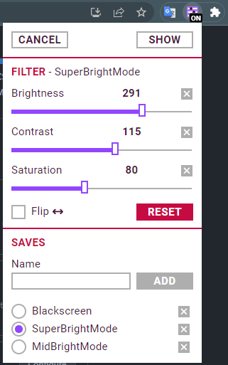

# Video filter chrome extension

## Overview

<figure style=" display: grid; grid-template-columns: 1fr 1fr; width: max-content; gap: 10px;">
  
  
  <figcaption>Extension popup</figcaption>
</figure>

The main idea of the extension is that just like we can adjust the volume of the video content, sometimes we need to adjust some parameters of the video image. This is mainly useful for videos on steaming platforms, like twitch, where the adjustment of the video image is quite arbitrary.

It may be useful for people with visual impairments to increase brightness and contrast with loss of details but with a clearer display of the main silhouettes.

### Extension features

1. Show video container on the page
2. Change video brightness(0-400%), contrast(0-200%), saturation(0-200%)
3. Flip video horizontally
4. Save filter state with alias / Restore filter state by alias
5. Accessible layout & keyboard navigation
6. Separate filter state for Tabs.

### Design

Figma [layout draft](https://www.figma.com/file/hmcOOhND0LHUrJdOEFo8cz/Twitch-video-filter?t=FC0zW5v5bj7pRjJ2-6)
